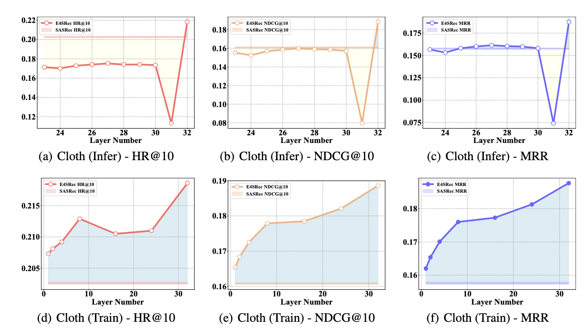
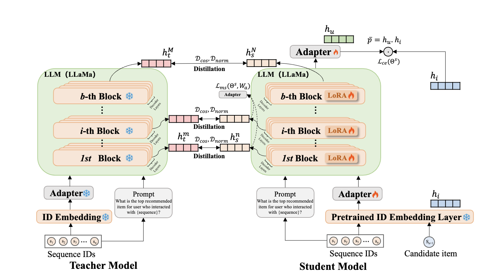

# SLMRec: Empowering Small Language Models for Sequential Recommendation
This repo presents the implementation of ICLR 2025 paper [**"SLMRec: Distilling Large Language Models into Small for Sequential Recommendation"**](https://openreview.net/forum?id=G4wARwjF8M "SLMRec")


## Key Features of SLMRec🔑

- **Motivational Experiments**: To explore the reasons for the significant improvement of LLMRec methods, we conduct a series of experiments on large-scale industry datasets to investigate the effects of reducing the number of parameters during the training and inference stages on overall performance. From the empirical results, we found some profound insights that the improvement of the rise of the model parameters is not consistent. Meanwhile, it reveals that some layers of LLMs are redundant in the recommendation task.

<div align=center></div>

- **Simple but Effective Method**: Motivated by these findings, we empower small language models for the sequential recommendation, named SLMRec. We adopt the vanilla knowledge distillation approaches to align the representation knowledge. Moreover, multiple supervision signals are crafted to steer the student model toward acquiring task-aware knowledge within its hidden representations. Extensive experiments have shown that SLMRec, with a model size under 1 billion parameters, not only achieves performance comparable to baselines using LLMs with over 7 billion parameters but also delivers up to 6.6x faster training and 8.0x faster inference compared to LLM-based recommendation models.

<div align=center></div>

## Getting Started 🚀

1. Clone the repository:
```bash
git clone https://github.com/WujiangXu/AgenticMemory.git
cd AgenticMemory

2. Install dependencies:
Option 1: Using venv (Python virtual environment)
```bash
# Create and activate virtual environment
python3.10 -m venv slmrec_env
source slmrec_env/bin/activate  # Linux/Mac
slmrec_env\Scripts\activate     # Windows

# Install dependencies
pip install -r requirements.txt
```

Option 2: Using Conda
```bash
# Create and activate conda environment
conda create -n slmrec_env python=3.9
conda activate slmrec_env
# Install dependencies
pip install -r requirements.txt
```


### Dataset🧑‍💻

#### Use Pre-processed Dataset

1. Download [prepared dataset](https://drive.google.com/drive/folders/1cambs_D6OpiWJE8ms5pdxcmoVfiOOlKg?usp=sharing).

#### Process by your own

1. Download [raw data](https://cseweb.ucsd.edu/~jmcauley/datasets/amazon_v2/).
2. Run the datasets/process.ipynb

### Training Processes
1. Train SR model to obtain the pretrained embedding layer.
```python   
python train_sr_trad.py
```

2. Save weights of embedding layer into local pkl file.
```python   
python extract_emb.py
```

3.1 Download pre-trained LLaMA model.


3.2 The teacher model can be trained using the provided script:

```bash
# Make the script executable
chmod +x run_finetune.sh

# Run the script with your desired output directory
bash run_finetune.sh /path/to/output/directory

# Example:
bash run_finetune.sh slmrec/cloth/teacher_model_decoder8/
```

4. Train a student model via knowledge distillation
The student model can be trained using the provided script:
```bash
chmod +x run_distill.sh

# Run the script with the teacher checkpoint path and student output directory
bash run_distill.sh <teacher_checkpoint_path> <output_directory>

# Example:
bash run_distill.sh slmrec/cloth/teacher_model_decoder8/checkpoint-1500/ slmrec/cloth/student_model_decoder4/
```

For the specific hyperparameters, please refer to the appendix in our paper. Besides, for the server with different GPU, please change the learning rate and batch size in the script.

**Note:** We have updated the experiment code from the paper to remove the 4-bit quantization implementation. This change was made because the original version had strict dependencies on specific CUDA and package versions, making it difficult to reproduce. The current implementation offers better compatibility while maintaining comparable performance.

## Reference📚

If you found the codes useful, please cite our paper.

      @inproceedings{xu2025slmrec,
            title = {SLMRec: Distilling Large Language Models into Small for Sequential Recommendation},
            author = {Wujiang Xu, Qitian Wu, Zujie Liang, Jiaojiao Han, Xuying Ning, Yunxiao Shi, Wenfang Lin, Yongfeng Zhang},
            booktitle = {International Conference on Learning Representations (ICLR 2025)},
            year = {2025}
      }

Also, thanks to the [E4SRec](https://github.com/HestiaSky/E4SRec/) team for releasing their code.

## Contact us 
Please feel free to contact us with the email to W. Xu "wujiang dot xu at rutgers dot edu" or "swustimp at gmail dot com".
